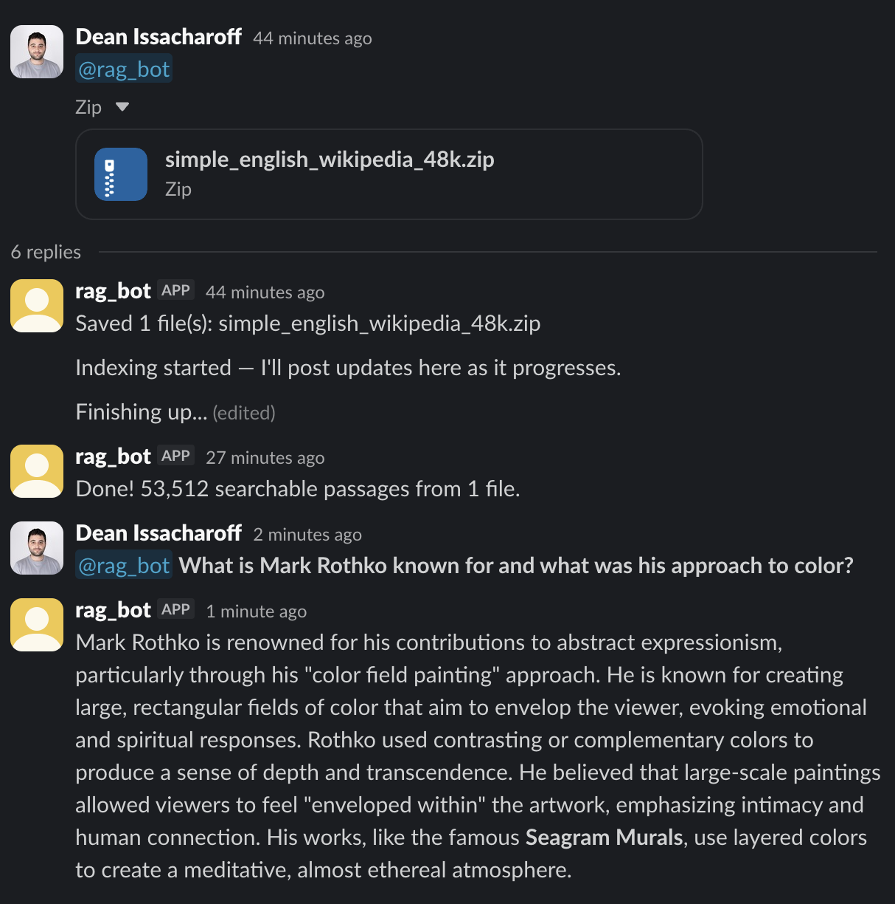
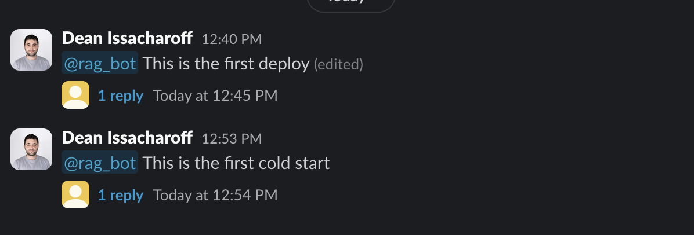
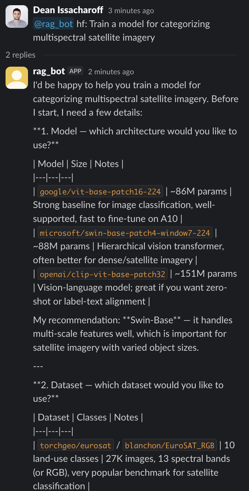
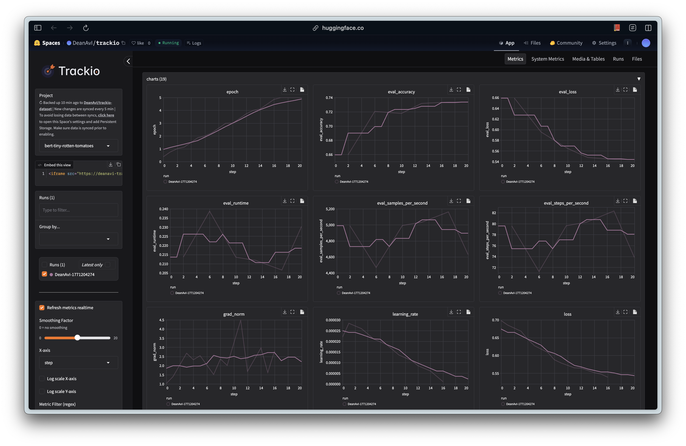

## TL;DR

This Slackbot allows you to deploy two secure and cost-efficient agentic workflows on private Modal infrastructure, without sharing data to third parties or exposing secrets to the agent.

1. **RAG agent** — automatically indexes files and zipped folders uploaded through Slack, then answers your questions using a local LLM. Your documents never leave the GPU.

2. **ML agent** — a Claude agent that trains and runs HuggingFace models on a GPU sandbox, without ever being exposed to your API keys.

Thanks to [Modal GPU snapshots](https://modal.com/docs/guide/memory-snapshot) there are no idle compute costs. The first deploy cold-starts vLLM and takes **~5 minutes** to create the initial snapshot. Every subsequent cold start restores from the snapshot and moves weights back to GPU in **~1 second** — but GPU provisioning adds **~2 minutes** of scheduling overhead, so end-to-end cold start latency is **~3 minutes**. Warm queries (container still alive) respond in **~6 seconds**.

- [Why This Exists](#why-this-exists)
- [Features](#whats-inside)
- [Architecture](#architecture)
- [Setup](#setup)
- [Demo](#demo)
  - [RAG: Wikipedia](#rag-wikipedia)
  - [ML Training](#ml-training)
- [Credits](#credits)

---

## Why This Exists

Basically, proprietary models are powerful generalists but expensive. Open-weight models are more accurate within their training domain and cheaper to run. This repo experiments with mixing both types into the same workflows to get secure, cost-efficient results.

The first workflow is an automated RAG pipeline that lets any user in a Slack workspace tag the bot to upload files and ask questions against those documents. It's completely private: document embedding, the vector database, and the LLM all run on Modal infrastructure. This also means you're not paying for idle compute. After 2 minutes of inactivity, the GPU shuts down, and spins back up quickly when tagged again, saving hundreds of dollars a month compared to renting a persistent GPU.

The second workflow uses GPU sandboxes to securely run a Claude agent with access to Hugging Face, letting you "vibe-tune" or "vibe-infer" any available model on any dataset and run your own experiments. The environment isn't attached to your file system, and your secrets are proxied into the sandbox, so the agent couldn't leak them if it tried.

It demonstrates how proprietary LLMs can use fine-tuned models as tools, processing data more accurately and cost-efficiently than they could otherwise. The example below shows a media processing task that would be out of reach for an LLM alone, since some data types fall outside what they're trained to handle.

---

### RAG Agent — Local LLM on GPU

A fully local RAG pipeline running [Qwen3-14B-AWQ](https://huggingface.co/Qwen/Qwen3-14B-AWQ) (4-bit AWQ) on an A10G GPU via [vLLM](https://github.com/vllm-project/vllm). No external API calls for inference. Documents are indexed with [ChromaDB](https://www.trychroma.com/) and queried through a [LlamaIndex](https://www.llamaindex.ai/) ReAct agent with three tools:

- **`search_documents`** — semantic search over indexed documents using [BGE-base-en-v1.5](https://huggingface.co/BAAI/bge-base-en-v1.5) embeddings
- **`execute_python`** — runs Python code for data analysis, chart generation, file processing (pandas, matplotlib, openpyxl pre-installed)
- **`list_documents`** — lists uploaded files so the agent can confirm paths before accessing them

Supports PDF, DOCX, CSV, Excel, and plain text. Indexing is incremental — only changed files are re-processed.

### ML Training Agent — Claude on GPU

A [Claude Agent SDK](https://docs.anthropic.com/en/docs/agents-and-tools/claude-agent-sdk) instance running on an A10 GPU sandbox. Writes and executes training code, installs packages, and trains HuggingFace models. The sandbox never sees the Anthropic API key — requests go through a proxy that swaps in the real key.

Training metrics sync to a [Trackio](https://huggingface.co/blog/trackio) dashboard on HuggingFace Spaces every ~30 seconds.

### Slack Commands

| Message | What happens |
|---------|-------------|
| Any text | RAG agent answers using indexed documents |
| `hf: <prompt>` | Routes to the ML training agent |
| Share/upload files | Downloads to volume, auto-triggers reindex |

---

## Architecture

Everything deploys as a single Modal app from `slackbot/app.py`.

The **Slack bot** is a FastAPI + slack-bolt server that stays warm (`min_containers=1`) with a CPU memory snapshot for fast restarts. It routes messages through a `Router` that dispatches to handler classes: file uploads go to indexing, `hf:` prefixed messages go to the ML agent, and everything else goes to the RAG agent.

The **RAG agent** runs as a Modal class on an A10G GPU. vLLM serves [Qwen3-14B-AWQ](https://huggingface.co/Qwen/Qwen3-14B-AWQ) (4-bit AWQ, ~8GB VRAM), ChromaDB stores embeddings, and a LlamaIndex ReAct agent orchestrates search and code execution. Documents never leave this container. GPU memory snapshots reduce cold starts. On first deploy the model loads into VRAM (~5 min), warms up with 3 inferences, then offloads weights to CPU RAM via vLLM's sleep mode before the snapshot is taken. Subsequent cold starts restore from the snapshot (~52s) and move weights back to GPU (~1s). Modal GPU provisioning adds ~2 minutes of scheduling overhead, so end-to-end cold start latency is ~3 minutes. Warm queries respond in ~6 seconds.

The **ML sandbox** runs on an A10 GPU. Each request launches a Claude Agent SDK session that can write code, install packages, and train models. It talks to the Anthropic API through a **proxy container** that intercepts requests and swaps the sandbox's fake key for the real one. The sandbox never sees your Anthropic API key.

The **Trackio syncer** polls a shared volume for metric databases and pushes updates to a HuggingFace Space dashboard.

Two volumes provide persistence: `sandbox-rag` holds documents, the vector store, and conversation history. `sandbox-data` holds model caches, training checkpoints, and session state.

---

## Setup

### 1. Clone and install

```bash
git clone https://github.com/DeanAvI/modal-sandbox.git
cd modal-sandbox
pip install modal
modal setup
```

### 2. Create a Slack app

Use the included [app manifest](slack-manifest.yaml) — it has all the required scopes and events pre-configured:

1. Go to [api.slack.com/apps](https://api.slack.com/apps) and click **Create New App → From a manifest**
2. Select your workspace, paste the contents of `slack-manifest.yaml`, and click **Create**
3. Under **OAuth & Permissions**, click **Install to Workspace** and authorize
4. Copy the **Bot User OAuth Token** (`xoxb-...`) from OAuth & Permissions
5. Copy the **Signing Secret** from **Basic Information → App Credentials**

### 3. Create Modal secrets

```bash
# Slack bot credentials
modal secret create slack-secret \
  SLACK_BOT_TOKEN=xoxb-... \
  SLACK_SIGNING_SECRET=...

# Anthropic API key (used by the proxy — never exposed to sandboxes)
modal secret create anthropic-secret ANTHROPIC_API_KEY=sk-ant-...

# HuggingFace token (for Trackio metric syncing)
modal secret create hf-secret HF_TOKEN=hf_...

# GitHub token (for ML agent repo access)
modal secret create github-secret GITHUB_TOKEN=ghp_...
```

### 4. Deploy

```bash
modal deploy -m slackbot.app
```

This deploys the Slack bot, API proxy, and pre-builds both GPU sandbox images. Modal will print the app URL — set this as the **Request URL** in your Slack app's **Event Subscriptions** settings (the bot listens on `/`).

### 5. Upload documents (optional)

Share files directly in Slack by uploading in a channel and tagging `@rag_bot` to index them.

---

## Demo

### RAG: Wikipedia

**How it works:** Share a file in Slack → the bot downloads it to a Modal volume → the indexer parses it into text, splits it into chunks (1024 tokens each), and embeds each chunk with [BGE-base-en-v1.5](https://huggingface.co/BAAI/bge-base-en-v1.5) on GPU → embeddings are stored in ChromaDB. When you ask a question, the ReAct agent retrieves the top-k most similar chunks, uses them as context, and generates an answer with the local LLM. Your files, embeddings, and queries never leave the GPU container.

The [Simple English Wikipedia dump](https://dumps.wikimedia.org/simplewiki/latest/) is a clean benchmark. The included subset has ~48,000 articles (31 MB compressed, 54 MB uncompressed). Too much for any context window, but exactly the kind of broad knowledge base where semantic search comes in handy.

Upload the zip to the bot in Slack and it extracts and indexes the articles automatically.

**How indexing works:** The pipeline runs in three phases:

1. **Scan** — compares each file's mtime and size against fingerprints stored in ChromaDB chunk metadata to find only new or changed files. Already-indexed content is skipped.
2. **Embed** — files are distributed across 8 parallel GPU workers on A10Gs, with up to 4 workers sharing each GPU concurrently (`@modal.concurrent(max_inputs=4)`). Each worker runs a [TEI](https://github.com/huggingface/text-embeddings-inference) embedding server as a sidecar subprocess, parses files, splits text into 1024-token chunks with 128-token overlap using a sentence-aware splitter, and embeds each chunk with [BGE-base-en-v1.5](https://huggingface.co/BAAI/bge-base-en-v1.5).
3. **Upsert** — CPU workers receive embeddings as they stream in from GPU workers and write them to ChromaDB in batches. ChromaDB is the sole source of truth for what has been indexed.

The subset zip is 31 MB (54 MB uncompressed) containing ~48,000 articles, producing **53,512 searchable passages**. Indexing took **17 minutes**: ~1.5 minutes for GPU embedding across 8 parallel workers, and the remainder loading shards into ChromaDB.





### ML Training

Prefix messages with `hf:` to route to the ML training agent:

> **You:** hf: Train a model for categorizing multispectral satellite imagery

The agent asks clarifying questions about model choice, dataset, and HuggingFace username before writing any code:


*Agent suggests models and datasets with tradeoffs, then waits for confirmation.*

Training metrics sync to a HuggingFace Space dashboard:


*Metrics sync every ~30 seconds via Trackio.*

---

## Credits

- **[Qwen3-14B-AWQ](https://huggingface.co/Qwen/Qwen3-14B-AWQ)** — 4-bit AWQ quantization by [Qwen](https://huggingface.co/Qwen), Alibaba Cloud.
- **transformers skill** — Originally by [jimmc414](https://github.com/jimmc414), from [Kosmos](https://github.com/jimmc414/Kosmos/tree/master/kosmos-claude-scientific-skills/scientific-skills/transformers). Modified to integrate Trackio.
- **hugging-face-trackio skill** — From the official [Hugging Face Skills](https://github.com/huggingface/skills) repo. Licensed under Apache 2.0.
- **Modal sandbox architecture** — Based on the [Claude Slack GIF Creator](https://modal.com/docs/examples/claude-slack-gif-creator) example from Modal's docs.
