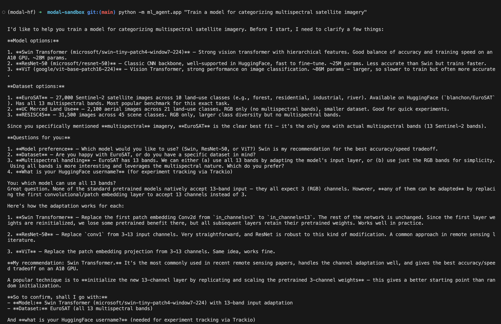

## TL;DR

LLMs are great orchestrators and easy to use but expensive, inaccurate on certain domain-specific tasks, and sometimes can't perform the task at all. Small open-weight models are accurate on tasks they're trained for, and more cost-efficient, but hard to deploy. This repo combines the best of both: a Claude agent training and running HuggingFace models, without exposing secrets or private data. All on Modal serverless infrastructure.

- [Why This Exists](#why-this-exists)
- [Architecture](#architecture)
- [Setup](#setup)
- [Demo](#demo) — [Train](#train) | [Inference](#inference)
- [Credits](#credits)

---

## Repository Structure

- **`ml_agent/`** — Claude agent running on a GPU-enabled sandbox. Requests are proxied to another container which holds the actual API keys.
- **`modal-ml-sandbox/`** — Claude skill for replicating the sandbox-proxy architecture from scratch.

---

## Why This Exists

My hot take is that agentic AI will further blur the line between ML engineers and AI engineers.

LLMs are great generalists, getting better at coding, and easy to use. But they hallucinate, lack domain-specific knowledge, and are expensive to run at scale. On the other hand, open-weight ML models can be more accurate relative to specific datasets, and cheap to fine-tune and run. But getting your code and data onto a GPU can be a nightmare.

The best of both worlds would be to use LLMs as agentic orchestrators of smaller open-source models, fine-tuning them on personal or public datasets. This would provide faster, more accurate results without obliterating your token budget. And your data stays private.

The missing piece is infrastructure that spins up an agent with GPU access, runs inference or trains models. That's what Modal's GPU-enabled sandboxes do: sub-second cold starts deployed with simple Python decorators. This doesn't only save time and money spent on tokens and infrastructure, it also protects your data. Sandboxes run agents in isolated environments, and you choose which files and secrets they can access.

Good agents need good infrastructure. Agentic AI faces three major challenges: security, cost, and accuracy. Infrastructure like Modal sandboxes allows isolating agents to ensure the blast radius from prompt injection or misaligned behavior is manageable. It also gives them access to accurate and cost-efficient open models as tools. All while keeping private data private.

---

## Architecture

| Component | Environment | Role |
|-----------|-------------|------|
| **Local** | Your machine | Runs `app.py` to create the sandbox and manages multi-turn conversation with the agent |
| **Sandbox** | GPU container | Runs Claude Agent SDK with mounted volumes for persistent data and a GitHub token |
| **Proxy** | CPU container | FastAPI server that secures Anthropic API calls — swaps the sandbox's ID (fake key) for the real Anthropic API key from its secret before forwarding, so the sandbox never sees the key |
| **Trackio Syncer** | CPU container | Polls the shared Trackio volume and uploads metric database changes to a Hugging Face Space for live visualization |
| **`sandbox-data` volume** | Shared volume | Mounted at `/data` — HuggingFace model/dataset cache (`HF_HOME=/data/hf-cache`) and training checkpoints |
| **`sandbox-trackio` volume** | Shared volume | Mounted at `~/.cache/huggingface/trackio` — Trackio metric databases (`.db` files) and the `space_id` file that tells the syncer where to push |

---

## Setup

### 1. Clone and install dependencies

```bash
git clone https://github.com/DeanAvI/modal-sandbox.git
cd modal-sandbox
pip install modal
modal setup
```

### 2. Add your secrets

The sandbox architecture uses three Modal secrets so that API keys are never exposed to the agent:

```bash
# Anthropic API key (used by the proxy, never seen by the sandbox)
modal secret create anthropic-secret ANTHROPIC_API_KEY=sk-ant-...

# HuggingFace token (used by the Trackio syncer)
modal secret create hf-secret HF_TOKEN=hf_...

# GitHub token (used by the sandbox for repo access)
modal secret create github-secret GITHUB_TOKEN=ghp_...
```

### 3. Deploy the Trackio syncer

```bash
modal deploy ml_agent.infra.trackio_sync
```

---

## Demo

The agent can handle tasks that LLMs can't do alone, like processing unique media formats, or process data faster and more cost-efficiently than an LLM could. Multispectral satellite imagery is a good example. Each image has 13 bands of light — beyond the 3 RGB channels an LLM can process. An LLM literally can't see the data. But a fine-tuned Swin Transformer can process all 13 bands and classify land use with high accuracy, cheaply and fast.

This demo uses the agent to train an image classification model on all 13 multispectral bands, display training metrics in a dashboard, and run inference. Future versions could include local or cloud file uploads to run on personal data, and Slack integration to trigger workflows from a familiar interface.

### Train

Run the command with an initial prompt. This will launch a multi-turn chat interface that searches through models and datasets available on HuggingFace.

```bash
python -m ml_agent.app "Train a model for categorizing multispectral satellite imagery"
```

The agent asks clarifying questions about model choice, dataset, and HuggingFace username before writing any code:


*Agent suggests models and datasets with tradeoffs, then waits for the user to confirm.*

Providing your HuggingFace username enables live metric tracking via [Trackio](https://huggingface.co/blog/trackio):


*Training metrics sync to a HuggingFace Space dashboard every ~30 seconds.*

The agent adapts the Swin Transformer's input layer from 3 RGB channels to 13 multispectral bands, initializing weights by replicating and scaling the pretrained 3-channel weights. It also replaces the classification head for 10 land-use classes, and adjusts the window size and image resolution to handle 64x64 satellite tiles.

Once training completes:

<blockquote>
<b>Agent</b>
<br><br>

| Metric | Validation | Test |
|---|---|---|
| **Accuracy** | **98.76%** | **98.72%** |
| **F1 (weighted)** | **98.76%** | **98.72%** |
| Loss | 0.0694 | 0.0723 |

- **Model**: Swin Transformer (swin-tiny) adapted for 13-band multispectral input
- **Dataset**: EuroSAT — 27,000 Sentinel-2 images across 10 land-use classes (all 13 bands)
- **Input**: 64x64 TIF files resized to 128x128, per-band normalization
- **Epochs**: 15 with cosine LR schedule (lr=5e-5)
- **Precision**: FP16 mixed precision
- **Training time**: ~35 minutes on A10 GPU

Best model saved to `/data/runs/swin-eurosat-multispectral-1771389072/checkpoint`. Metrics synced to Trackio dashboard at `DeanAvI/trackio`.
</blockquote>

### Inference

In the same session, ask the agent to run inference and save results:

<blockquote>
<b>You</b>
<br><br>

`now run on test set, and write results as a csv to the volume`
</blockquote>

<blockquote>
<b>Agent</b>
<br><br>

**Overall: 98.72% accuracy** (5,331 / 5,400 correct, 69 errors)

| Class | Samples | Accuracy |
|---|---|---|
| SeaLake | 609 | **99.84%** |
| Forest | 608 | 99.67% |
| Residential | 554 | 99.46% |
| River | 529 | 99.24% |
| AnnualCrop | 596 | 99.16% |
| HerbaceousVegetation | 573 | 98.95% |
| Highway | 496 | 98.19% |
| Industrial | 501 | 97.60% |
| PermanentCrop | 538 | 97.21% |
| Pasture | 396 | 96.97% |

The errors make intuitive sense — they're between visually and spectrally similar land cover types: **PermanentCrop** confused with **HerbaceousVegetation** (both green vegetation), **Pasture** with **HerbaceousVegetation** (spectrally similar), and **Industrial** with **Residential** (both built-up areas).

CSV saved to `/data/runs/swin-eurosat-multispectral-1771389072/test_results.csv` with per-sample predictions, confidence scores, and per-class probabilities.

Inference throughput is ~5,000 samples/second (~0.2ms per image) on an A10 GPU — thousands of times faster than sending each image to an LLM API.
</blockquote>

---

## To Do

- Ultralytics skill
- Ollama skill
- Slack integration
- Local file upload
- Google Drive integration
- Notion integration

---

## Credits

- **transformers skill** — Originally by [jimmc414](https://github.com/jimmc414), from [Kosmos](https://github.com/jimmc414/Kosmos/tree/master/kosmos-claude-scientific-skills/scientific-skills/transformers). Modified to integrate Trackio.
- **hugging-face-trackio skill** — From the official [Hugging Face Skills](https://github.com/huggingface/skills) repo. Licensed under Apache 2.0.
- **Modal sandbox architecture** — Based on the [Claude Slack GIF Creator](https://modal.com/docs/examples/claude-slack-gif-creator) example from Modal's docs.
- **Claude Code skills** — Built following the [Skills how-to guide](https://claude.com/docs/skills/how-to) from Claude's docs.
